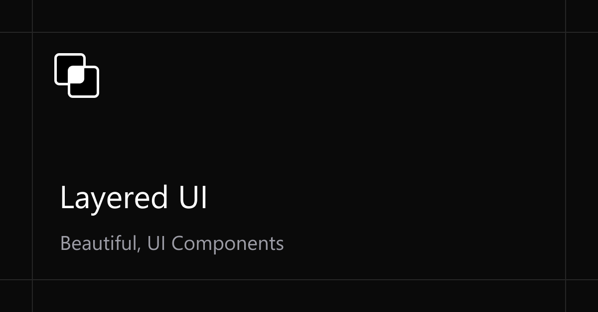

<h3 align="center">Layered UI</h3>

<p align="center">
  Speed up your workflow with responsive, pre-built <b>shadcn/ui</b> blocks designed for SaaS and marketing websites.
</p>

<div align="center">
  <a href="https://github.com/KingTroy125/Layered-UI/stargazers">
    
  </a>
  <a href="./LICENCE.md">
    
  </a>
</div>

<br />

---

## About

**Layered UI** is a modern collection of beautifully crafted, responsive UI blocks built with **shadcn/ui**, **Tailwind CSS 4**, and **Next.js 16**.

It helps developers and designers quickly build:
- SaaS landing pages  
- Marketing websites  
- Startup products   

All components are easy to customize, accessible, and production-ready. You can either clone the repository to use as a template or install individual blocks via the shadcn CLI.

---

## Features

- **Built with shadcn/ui**: Leveraging the best-in-class UI components.
- **Tailwind CSS 4**: Optimized for the latest version of Tailwind CSS.
- **Fully Responsive**: Every block is designed to look great on any device.
- **Accessibility-first**: Follows WAI-ARIA patterns for inclusive web experiences.
- **Shadcn Registry**: Install blocks directly into your project via CLI.
- **Modern Tech Stack**: Powered by React 19, Next.js 16, and Motion.

---

## Tech Stack

- **Framework**: [Next.js 16](https://nextjs.org/) (App Router)
- **Library**: [React 19](https://react.dev/)
- **Styling**: [Tailwind CSS 4](https://tailwindcss.com/)
- **Components**: [shadcn/ui](https://ui.shadcn.com/)
- **Icons**: [Lucide React](https://lucide.dev/)
- **Animations**: [Motion](https://motion.dev/) (Framer Motion)

---

## Getting Started (Local Development)

### 1. Clone the repository

```bash
git clone https://github.com/KingTroy125/Layered-UI.git
cd Layered-UI
```

### 2. Install dependencies

```bash
npm install
# or
pnpm install
```

### 3. Run the development server

```bash
npm run dev
# or
pnpm dev
```

Open [http://localhost:3000](http://localhost:3000) with your browser to see the result.

---

## Using the Layered Registry

You can install production-ready blocks directly into your project using the shadcn CLI.

### 1. Add Registry

Add the Layered registry to your `components.json`:

```json
{
  "registries": {
    "@layeredui": "https://layered-blocks.vercel.app/r/{name}.json"
  }
}
```

### 2. Install Blocks

Install blocks via the shadcn CLI using the `@layeredui/{name}` syntax:

```bash
npx shadcn add @layeredui/hero-section-1
```

Explore available block names on the [official website](https://layered-blocks.vercel.app).

---

## Block Categories

Layered UI provides a wide variety of blocks to kickstart your project:

- **Hero Sections**: High-impact headers for your landing page.
- **Features**: Showcase your product's capabilities.
- **Pricing**: Clear and effective pricing tables.
- **Testimonials**: Build trust with social proof.
- **Contact & Forms**: Ready-to-use login, sign-up, and contact forms.
- **Footers**: Multi-purpose footer designs.
- **And more**: Call to Action, Logo Clouds, Stats, Team sections, etc.

---

## MCP Configuration

Layered UI supports Model Context Protocol (MCP) to help AI assistants understand and use these blocks.

### Configure MCP

```bash
npx shadcn mcp init
```

Select your MCP client when prompted. Once enabled, you can prompt your AI assistant:
- *"Find me a hero from layered registry"*
- *"Build me a landing page using a hero and features section from layered registry"*

---

## License

Distributed under the MIT License. See `LICENSE.md` for more information.
