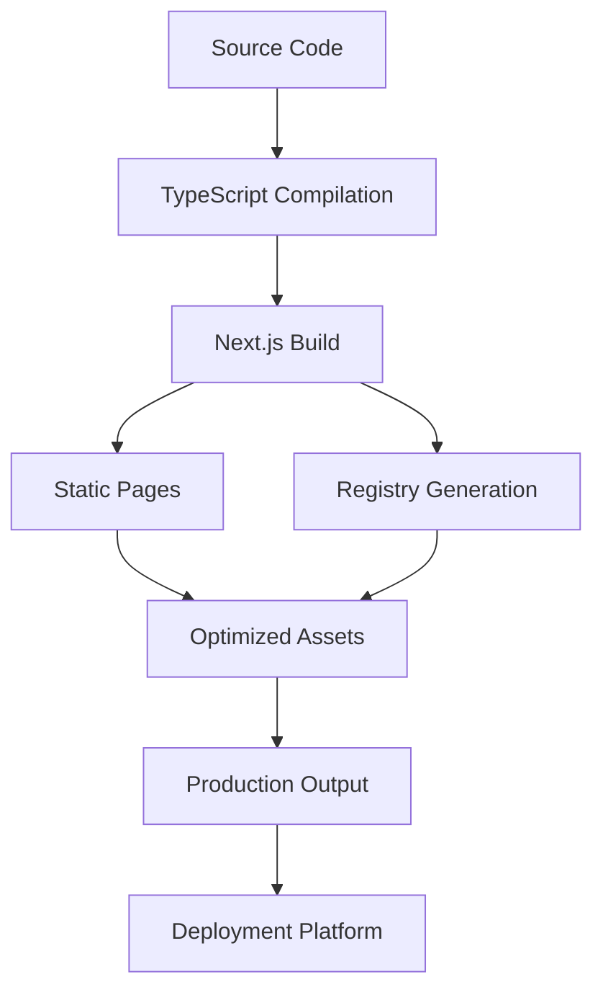
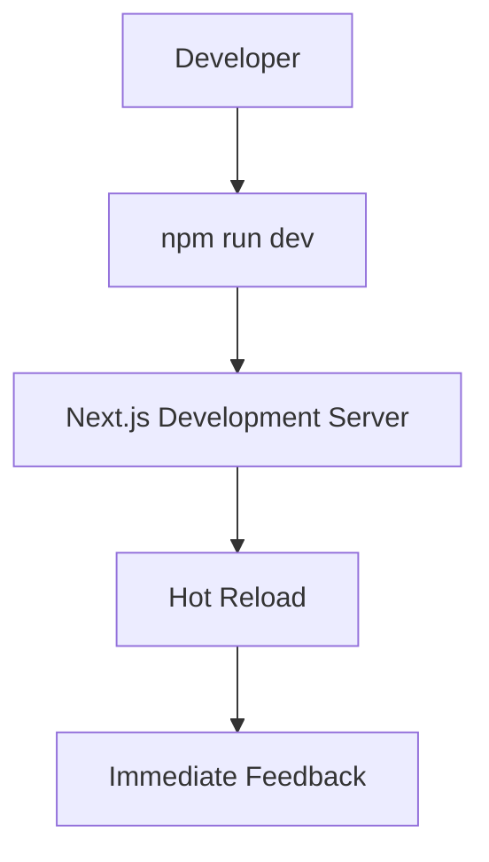
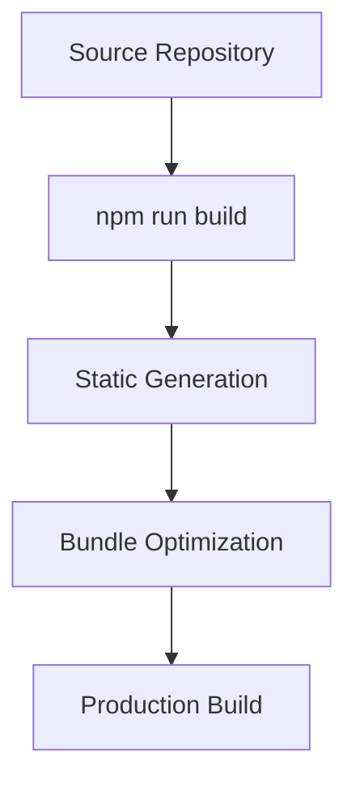

# Build & Delivery

The **Build & Delivery** architecture defines how Layered UI is transformed from a development repository into a production-ready application and an installable component registry.

The project is designed around a deterministic build pipeline that generates static application pages, registry artifacts, and optimized assets while minimizing runtime complexity. By separating development, build, and delivery concerns, the platform remains fast, reliable, and easy to deploy.

---

# Purpose

The build and delivery pipeline is designed to:

* Produce optimized production builds.
* Generate static application pages.
* Build installable registry packages.
* Validate metadata consistency.
* Optimize assets for deployment.
* Enable repeatable and deterministic builds.
* Simplify deployment to static-friendly hosting platforms.

Every build should produce identical output when executed from the same source revision.

---

# Build Pipeline Overview

The complete build pipeline follows a predictable sequence.



Each stage performs a specific transformation while preserving a deterministic output.

---

# Build Responsibilities

The build system performs several tasks automatically.

These include:

* Compiling TypeScript.
* Building the Next.js application.
* Generating static routes.
* Optimizing JavaScript bundles.
* Processing CSS.
* Creating optimized images.
* Building registry JSON files.
* Preparing production assets.

Developers should not manually modify generated output.

---

# Development Workflow

Local development prioritizes fast iteration.

Typical workflow:



The development server enables rapid iteration while preserving production parity.

---

# Production Build

Production builds optimize the application for deployment.

Typical workflow:



Only production-ready assets are included in the final output.

---

# Registry Generation

The registry is generated independently from the application.

```text
registry.json
      │
      ▼
Registry Builder
      │
      ▼
Validation
      │
      ▼
public/r/
```

Each registry item becomes a static JSON file that can be consumed without requiring a backend service.

---

# Build Artifacts

The build process produces several categories of artifacts.

| Artifact           | Purpose                     |
| ------------------ | --------------------------- |
| Static pages       | Application routes          |
| JavaScript bundles | Interactive functionality   |
| CSS assets         | Styling                     |
| Optimized images   | Performance                 |
| Registry JSON      | Component installation      |
| Metadata           | Route and asset information |

Generated artifacts should never become the primary source of truth.

---

# Static Generation

Most application pages are statically generated.

Examples include:

* marketing pages,
* documentation,
* category pages,
* registry assets.

Benefits include:

* lower latency,
* improved SEO,
* reduced server load,
* CDN compatibility.

Interactive functionality is hydrated only when required.

---

# Asset Optimization

The build process automatically optimizes static assets.

Optimizations include:

* JavaScript bundling
* Code splitting
* CSS optimization
* Image optimization
* Font optimization
* Tree shaking
* Compression-ready output

These optimizations reduce download size and improve runtime performance.

---

# Caching Strategy

The delivery architecture is designed for aggressive caching.

```text
Browser
     │
     ▼
CDN Cache
     │
     ▼
Static Assets
```

Suitable cache candidates include:

* documentation,
* registry JSON,
* images,
* fonts,
* JavaScript bundles.

Static delivery minimizes infrastructure requirements while improving response times.

---

# Continuous Integration

A typical CI pipeline follows this sequence.

```text
Pull Request
      │
      ▼
Install Dependencies
      │
      ▼
Lint
      │
      ▼
Type Check
      │
      ▼
Run Tests
      │
      ▼
Build Application
      │
      ▼
Generate Registry
      │
      ▼
Deploy
```

Automated validation helps detect issues before deployment.

---

# Deployment Strategy

Layered UI is optimized for deployment on platforms that support Next.js and static asset hosting.

The deployment process generally includes:

1. Installing project dependencies.
2. Building the application.
3. Generating registry artifacts.
4. Uploading static assets.
5. Deploying the application.
6. Invalidating outdated caches.

Because registry files are static, they can be served efficiently from a CDN.

---

# Build Scripts

Typical project scripts include:

| Script                   | Purpose                      |
| ------------------------ | ---------------------------- |
| `npm run dev`            | Start the development server |
| `npm run build`          | Create the production build  |
| `npm run start`          | Run the production server    |
| `npm run lint`           | Execute ESLint               |
| `npm run registry:build` | Generate registry artifacts  |

Each script has a single responsibility and can be integrated into automated workflows.

---

# Failure Scenarios

Several common issues can interrupt the build pipeline.

| Failure                   | Impact                    | Mitigation                                 |
| ------------------------- | ------------------------- | ------------------------------------------ |
| TypeScript errors         | Build fails               | Fix compile-time issues before deployment  |
| Missing registry metadata | Registry generation fails | Validate `registry.json`                   |
| Invalid catalog metadata  | Missing catalog entries   | Validate `data/blocks.ts`                  |
| Missing dependencies      | Runtime failures          | Keep dependencies synchronized             |
| Asset generation failures | Broken production output  | Validate build artifacts before deployment |

Maintaining a deterministic build process helps identify failures early.

---

# Design Principles

The build pipeline follows several architectural principles.

## Deterministic Builds

The same source should always generate the same output.

---

## Static by Default

Generate as much content as possible during the build rather than at runtime.

---

## Automation

Manual build steps should be minimized.

---

## Separation of Concerns

Application builds and registry generation remain independent while sharing common source code.

---

## Performance

Optimize assets during the build rather than relying solely on runtime optimizations.

---

# Future Improvements

The build system is designed to accommodate future enhancements such as:

* Incremental Static Regeneration (ISR)
* Automated registry publishing
* Preview deployments
* Bundle size reporting
* Performance budgets
* Visual regression testing
* Automated release workflows

These improvements can be introduced without significantly altering the existing architecture.

---

# Summary

The Build & Delivery architecture transforms Layered UI from a repository of reusable components into a production-ready application and installable registry. By emphasizing deterministic builds, static generation, automated validation, and optimized asset delivery, the platform achieves reliable deployments, excellent performance, and a scalable foundation for future growth.

---

# Related Documents

* **Routing Model** — How pages and routes are organized.
* **Data & Registry Flow** — How metadata becomes installable registry assets.
* **Component Architecture** — The reusable building blocks that are compiled during the build.
* **Quality Attributes** — The architectural characteristics the build pipeline helps achieve.
